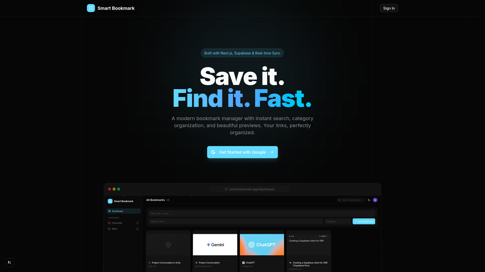
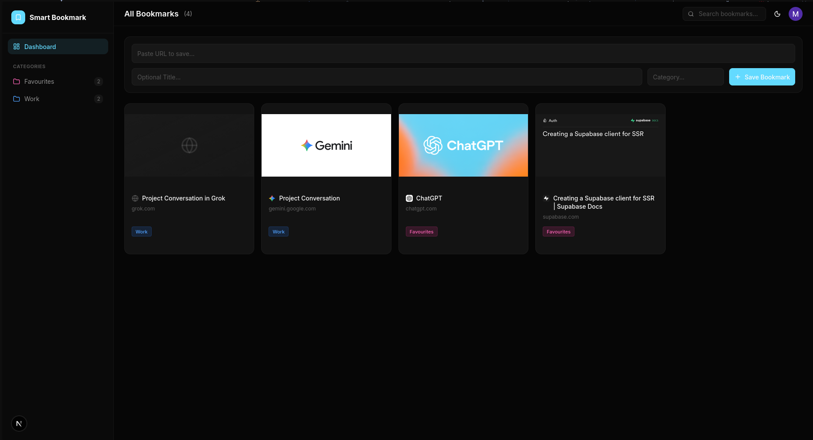

# Smart Bookmark Manager

> A production-grade, real-time bookmark manager built with **Next.js 16 (App Router)**, **Supabase**, and **Tailwind CSS** — submitted as a solution to the Micro Challenge by **Abstrabit Technologies Pvt. Limited** for the Full Stack Intern position.





---

## Features

| Feature | Description |
|---|---|
| **Google OAuth** | One-click sign-in via Google — no email/password flows |
| **Add Bookmarks** | Paste any URL — metadata (title, OG image, favicon) is auto-extracted server-side |
| **Optional Title & Category** | Override the auto-fetched title or organize into custom categories |
| **Real-time Sync** | Open two tabs — add or delete a bookmark in one, it instantly appears/disappears in the other |
| **Private by Design** | Row-Level Security (RLS) ensures users can only see and manage their own bookmarks |
| **Optimistic UI** | Bookmarks appear/disappear instantly on action — no waiting for server round-trips |
| **Category Sidebar** | Filter bookmarks by category with dynamic counts and color-coded icons |
| **Live Search** | Client-side search filtering across titles, URLs, and categories |
| **Dark/Light Theme** | System-aware theme switching with `next-themes` |
| **3D Landing Page** | Professional landing page with perspective-tilted screenshot preview |
| **Responsive Grid** | Adaptive grid layout: 1 → 2 → 3 → 4 → 5 columns across breakpoints |
| **Animated Transitions** | Framer Motion `AnimatePresence` for smooth card enter/exit animations |
| **Metadata Scraping** | Server-side HTML parsing with Cheerio for OG tags, favicons, and Twitter cards |

---

## Architecture

```
src/
├── app/
│   ├── page.tsx                  # Landing page (server component)
│   ├── layout.tsx                # Root layout with ThemeProvider
│   ├── auth/
│   │   ├── actions.ts            # signInWithGoogle, signOut server actions
│   │   └── callback/route.ts     # OAuth callback handler
│   └── dashboard/
│       ├── page.tsx              # Dashboard (server component, fetches data)
│       ├── layout.tsx            # Auth-guarded layout
│       └── actions.ts            # addBookmark, deleteBookmark server actions
├── components/
│   ├── dashboard-shell.tsx       # Client shell: sidebar + header + grid + form
│   ├── sidebar.tsx               # Category navigation with dynamic counts
│   ├── header.tsx                # Top bar: title, search, theme toggle, user avatar
│   ├── bookmark-card.tsx         # Card with image, favicon, title, category badge
│   ├── bookmark-form.tsx         # URL + optional title + category input
│   └── user-nav.tsx              # User avatar dropdown with sign-out
├── hooks/
│   └── use-realtime-bookmarks.ts # Supabase Realtime subscription hook
├── lib/supabase/
│   ├── client.ts                 # Browser Supabase client
│   ├── server.ts                 # Server Supabase client (cookies)
│   └── proxy.ts                  # Middleware session management
├── proxy.ts                      # Next.js middleware entry point
└── types/
    └── supabase.ts               # Auto-generated database types
```

### Data Flow

```
User Action → Optimistic UI Update → Server Action → Supabase DB
                                                         │
                                                         ▼
                                              Realtime Broadcast
                                                         │
                                                         ▼
                                              All Tabs: router.refresh()
```

---

## Authentication Flow

1. **Google Cloud Console** — Created an OAuth 2.0 project, configured the consent screen, and obtained the **Client ID** and **Client Secret**
2. **Supabase Dashboard** → Authentication → Providers → Enabled **Google** and pasted the Client ID/Secret
3. **OAuth Redirect** — Configured `{SITE_URL}/auth/callback` as the authorized redirect URI in both Google Cloud Console and Supabase
4. **Next.js Middleware** (`src/proxy.ts`) — Intercepts every request, validates the session via `supabase.auth.getUser()`, and refreshes tokens automatically
5. **Callback Route** (`src/app/auth/callback/route.ts`) — Exchanges the OAuth code for a session using `supabase.auth.exchangeCodeForSession(code)`

---

## Database & Migrations

### Supabase CLI Workflow

I used the **Supabase CLI** for a fully reproducible database setup:

```bash
# Generate TypeScript types from the live schema
npx supabase gen types typescript --project-id YOUR_PROJECT_ID > src/types/supabase.ts

# Create new migrations with descriptive names
npx supabase migration new create_bookmarks
npx supabase migration new add_category_to_bookmark
npx supabase migration new modify_category_field

# Push all migrations to the remote database
npx supabase db push
```

This workflow made the setup **reproducible and version-controlled** — anyone cloning the repo can run `npx supabase db push` to get the exact same schema.

### Migration 1: `create_bookmarks`

```sql
CREATE TABLE public.bookmarks (
  id UUID DEFAULT gen_random_uuid() PRIMARY KEY,
  user_id UUID REFERENCES auth.users(id) ON DELETE CASCADE NOT NULL DEFAULT auth.uid(),
  title TEXT NOT NULL CHECK (char_length(title) > 0),
  url TEXT NOT NULL CHECK (url ~ '^https?://'),
  meta_image TEXT,
  meta_favicon TEXT,
  created_at TIMESTAMPTZ DEFAULT now() NOT NULL
);

-- Row-Level Security: users can ONLY manage their own bookmarks
ALTER TABLE public.bookmarks ENABLE ROW LEVEL SECURITY;

CREATE POLICY "Users manage own bookmarks"
  ON public.bookmarks FOR ALL
  USING (auth.uid() = user_id)
  WITH CHECK (auth.uid() = user_id);

-- Enable Realtime subscriptions
ALTER PUBLICATION supabase_realtime ADD TABLE public.bookmarks;
```

**Key decisions:**
- `user_id DEFAULT auth.uid()` — automatically stamps the current user on insert
- `ON DELETE CASCADE` — when a user is deleted from `auth.users`, their bookmarks are cleaned up
- **Single RLS policy** covering `SELECT`, `INSERT`, `UPDATE`, `DELETE` — a user can never interact with another user's data
- `url ~ '^https?://'` — database-level URL validation
- Table added to `supabase_realtime` publication for live updates

### Migration 2 & 3: Adding Categories

```sql
-- Migration 2: Add column
ALTER TABLE public.bookmarks ADD COLUMN category TEXT;

-- Migration 3: Backfill and enforce
ALTER TABLE public.bookmarks ALTER COLUMN category SET DEFAULT 'Favourites';
UPDATE public.bookmarks SET category = 'Favourites' WHERE category IS NULL;
ALTER TABLE public.bookmarks ALTER COLUMN category SET NOT NULL;
```

Split into two migrations to safely add the column, backfill existing data, then enforce the `NOT NULL` constraint — avoiding downtime or failed migrations on tables with existing rows.

---

## 🧩 Tech Stack

| Technology | Purpose |
|---|---|
| **Next.js 16** (App Router) | Framework — Server Components, Server Actions, Middleware |
| **React 19** | UI with `useOptimistic`, `startTransition` |
| **Supabase** | Auth (Google OAuth), PostgreSQL Database, Row-Level Security, Realtime |
| **Supabase CLI** | Type generation (`gen types`), migrations (`migration new`), deployment (`db push`) |
| **Tailwind CSS 4** | Utility-first styling with CSS variables |
| **shadcn/ui** | Accessible UI primitives (Cards, Buttons, Inputs, Dropdowns) |
| **Framer Motion** | Layout animations and `AnimatePresence` transitions |
| **Cheerio** | Server-side HTML parsing for OG metadata extraction |
| **Sonner** | Toast notifications for success/error feedback |
| **next-themes** | Dark/Light/System theme management |
| **Lucide React** | Icon library |
| **Vercel** | Deployment platform |

---

## 🚀 Getting Started

### Prerequisites

- Node.js 18+
- A Supabase project
- A Google Cloud Console OAuth 2.0 Client

### Setup

```bash
# 1. Clone the repo
git clone https://github.com/YOUR_USERNAME/smart-bookmark-manager.git
cd smart-bookmark-manager

# 2. Install dependencies
npm install

# 3. Create .env.local
cp .env.example .env.local
# Fill in:
#   NEXT_PUBLIC_SUPABASE_URL=your_supabase_url
#   NEXT_PUBLIC_SUPABASE_PUBLISHABLE_KEY=your_supabase_publishable_key
#   NEXT_PUBLIC_SITE_URL=http://localhost:3000

# 4. Push database migrations
npx supabase db push

# 5. Run the dev server
npm run dev
```

### Google OAuth Setup

1. Go to [Google Cloud Console](https://console.cloud.google.com/)
2. Create a new project → APIs & Services → Credentials → OAuth 2.0 Client ID
3. Set authorized redirect URI: `https://YOUR_PROJECT.supabase.co/auth/v1/callback`
4. Copy Client ID and Client Secret
5. In Supabase Dashboard → Authentication → Providers → Google → Paste credentials and enable

---

## 🐛 Problems I Ran Into & How I Solved Them

### 1. SSL Error on Production Build (`next start`)

**Problem:** After running `next build && next start`, signing in with Google caused an `SSL_ERROR_RX_RECORD_TOO_LONG` error. The dev server (`next dev`) worked fine.

**Root Cause:** The `origin` header from the request was resolving to `https://localhost:3000` in production mode, but `next start` only serves HTTP. The OAuth callback redirect URL used HTTPS, and the browser rejected the non-SSL connection.

**Solution:** Introduced a `NEXT_PUBLIC_SITE_URL` environment variable that takes priority over the `origin` header:

```typescript
const origin = process.env.NEXT_PUBLIC_SITE_URL
  || headersList.get('origin')
  || 'http://localhost:3000'
```

### 2. Real-time Updates Across Tabs

**Problem:** Needed bookmarks to sync across multiple browser tabs without manual refresh.

**Solution:** Created a `useRealtimeBookmarks` hook that subscribes to Postgres changes on the `bookmarks` table and calls `router.refresh()` on any `INSERT`, `UPDATE`, or `DELETE` event. Combined with Server Components, this re-fetches data from the server automatically.

### 3. Optimistic UI with Server Actions

**Problem:** Adding/deleting bookmarks felt slow because the UI waited for the server round-trip.

**Solution:** Used React 19's `useOptimistic` hook to immediately reflect changes in the UI, then reconcile with the server response. If the server action fails, the optimistic state is reverted and an error toast is shown.

### 4. Metadata Extraction for Arbitrary URLs

**Problem:** Fetching OG metadata from external URLs can be slow, fail, or return unexpected formats.

**Solution:** Implemented a 5-second timeout with `AbortController`, parsed HTML with Cheerio for `og:title`, `og:image`, and favicon, and added cascading fallbacks:
- Title: User-provided → `og:title` → `<title>` → URL
- Favicon: `<link rel="icon">` → `{origin}/favicon.ico` → Google Favicon Service
- Image: `og:image` → `twitter:image` → null

### 5. Category Migration Without Downtime

**Problem:** Adding a `NOT NULL` category column to a table with existing data would fail.

**Solution:** Split into two migrations — first add the nullable column, then backfill existing rows with `'Favourites'` and set the `NOT NULL` constraint.

### 6. Paste Not Working in Input Fields

**Problem:** Users couldn't paste URLs into the input fields.

**Solution:** Removed `autoComplete="off"` from the input elements, which was interfering with paste behavior in some browsers.

---

## Challenge Requirements Checklist

| Requirement | Status |
|---|---|
| Google OAuth sign-in (no email/password) | ✅ |
| Add bookmark (URL + title) | ✅ (+ optional category) |
| Bookmarks private per user (RLS) | ✅ |
| Real-time sync across tabs | ✅ |
| Delete own bookmarks | ✅ |
| Deployed on Vercel | ✅ |
| Next.js App Router | ✅ (v16) |
| Supabase (Auth, Database, Realtime) | ✅ |
| Tailwind CSS | ✅ (v4) |
| README with problems & solutions | ✅ |

### Beyond the Requirements

- Professional UI with sidebar layout, category filtering, and search
- Optimistic updates with React 19 `useOptimistic`
- Auto-extracted OG metadata (images, favicons, titles)
- Custom categories with color-coded badges
- Dark/Light theme support
- Fully responsive design
- Database-level URL validation and constraints
- Supabase CLI for reproducible migrations and type safety

---

## License

MIT